# Zhihu Reader 实施任务拆分

## 1. 拆分原则

每个 task 都应形成一个可独立体验、可自动验证、可单独合并的纵向增量。不要分别创建“先写全部 API”“再写全部 React”“最后补测试”的横向任务。

统一完成标准：

- 实现包含必要的 UI、状态、模块和测试，而不只完成其中一层。
- 新行为从模块的正式接口进行测试，不测试内部实现细节。
- `npm run check` 全部通过。
- 不引入与当前 task 无关的产品范围。
- 错误、加载和空状态与成功路径同时完成。

## 2. 模块与 seam

正式实现建议围绕以下深模块组织：

| 模块 | 小接口 | 隐藏的复杂度 |
| --- | --- | --- |
| `ZhihuTargetParser` | `parse(input)` | URL 规范化、问题/回答识别、错误信息 |
| `ZhihuGateway` | `getQuestion`、`getAnswer`、`getAnswerPage` | URL、请求头、Cookie、Zod、知乎错误格式 |
| `ReaderSession` | `open`、`next`、`previous`、`snapshot` | 首项队列、去重、分页、排序、并发和失败恢复 |
| `PluginDataRepository` | `load`、`save` | Zod 默认值、迁移、Obsidian `loadData/saveData` |
| `QuestionHistory` | `record`、`list`、`remove`、`clear` | 问题 ID 去重、排序、上限和持久化 |
| `DailyHotList` | `load`、`snapshot`、`subscribe` | 请求合并、短时缓存、刷新、过期结果和错误恢复 |
| `AuthorAnswerList` | `showAuthor`、`loadMore`、`retry` | 延迟加载、作者切换、分页游标、去重和局部错误恢复 |
| `AnswerCommentList` | `showAnswer`、`loadMore`、`toggleReplies` | 排序、根评论/子回复分页、去重、并发和局部错误恢复 |
| `ZhihuAnswerSearch` | `search`、`loadMore`、`retry` | 关键词切换、回答过滤、分页、去重和过期响应 |
| `AnswerNoteWriter` | `save` | 路径模板、frontmatter、冲突、原子写入和附件 |

`ZhihuGateway` 面向真正的外部依赖知乎。其实现内部设置 `ZhihuTransport` seam：生产使用 Obsidian `requestUrl` adapter，测试使用 fixture adapter。调用者不接触 HTTP URL、原始 JSON 或 Zod schema。

`AnswerNoteWriter` 面向 Obsidian Vault seam：生产使用 Vault adapter，测试使用内存 adapter。文件名清理、目录创建和覆盖逻辑位于模块内部。

React 展示组件不直接调用网络、`loadData` 或 Vault。它们只接收 `ReaderSession` snapshot 和事件回调。

## 3. 依赖顺序

```mermaid
flowchart LR
    T00["ZA-00 领域类型与 fixtures"] --> T01["ZA-01 URL 查询入口"]
    T00 --> T02["ZA-02 设置与持久化基础"]
    T01 --> T03["ZA-03 公开回答阅读切片"]
    T02 --> T03
    T03 --> T04["ZA-04 问题回答队列"]
    T04 --> T05["ZA-05 回答 URL 首项队列"]
    T05 --> T06["ZA-06 问题查询历史"]
    T05 --> T07["ZA-07 保存 Markdown"]
    T07 --> T08["ZA-08 富内容与图片本地化"]
    T06 --> T09["ZA-09 知乎登录"]
    T08 --> T10["ZA-10 体验与兼容性收口"]
    T09 --> T12["ZA-12 每日热榜"]
    T04 --> T12
    T12 --> T13["ZA-13 作者回答 Popover"]
    T03 --> T13
    T13 --> T14["ZA-14 回答评论阅读"]
    T14 --> T15["ZA-15 搜索知乎回答"]
    T15 --> T16["ZA-16 回答点赞"]
    T16 --> T10
    T10 --> T11["ZA-11 发布准备"]
```



推荐严格依次完成 ZA-00 至 ZA-05。ZA-06 与 ZA-07 在队列稳定后可以独立进行，但发布前都必须完成。

## 4. Tasks

### ZA-00 领域类型与 API fixtures

目标：建立后续模块共享的稳定语言和测试样本。

实现内容：

- 定义 `ZhihuTarget`、`QuestionSummary`、`AnswerDocument`、`AnswerPage` 和 `ReaderSnapshot`。
- ID 一律使用字符串，禁止在领域类型中使用 `number`。
- 为问题详情、单篇回答、问题 feed、空问题和异常响应准备脱敏 JSON fixtures。
- ID schema 接受数字字符串和安全整数；超过 JavaScript 安全整数范围的 ID 必须由接口以字符串形式提供，非安全 `number` 作为无效响应拒绝。
- 调整现有 feed 规则：默认 `limit=6`，允许范围 `1–20`。
- Zod schema 保持在 `ZhihuGateway` 实现内部；UI 使用转换后的领域类型。

验收标准：

- fixture 可以解析为领域类型。
- 字符串形式的超大 ID 不丢失精度，非安全数字 ID 返回可识别错误。
- 缺失可选字段时产生明确默认值；缺失必需字段时返回可识别错误。
- URL builder 对 `limit=0`、`21` 和非整数拒绝。

建议文件：

```text
src/domain/zhihu.ts
src/zhihu/schemas.ts
src/zhihu/urls.ts
tests/fixtures/zhihu/*.json
tests/zhihu-schemas.test.ts
```

### ZA-01 URL 查询入口

目标：用户可以从命令、Ribbon 和剪贴板提交问题或回答 URL，尚不要求真实加载内容。

实现内容：

- 实现 `ZhihuTargetParser.parse(input)`。
- 创建 `ZhihuUrlModal`，支持 Enter、Escape、自动聚焦和行内错误。
- 命令 `打开知乎内容`：先显示 Modal，成功解析后打开 View。
- 命令 `从剪贴板打开`：合法 URL 直接打开；非法内容显示可理解提示。
- Ribbon：打开空白阅读器或聚焦现有阅读器。
- 将解析后的 target 传给 View；View 暂时显示目标类型和 ID 的开发占位状态。

验收标准：

- 支持问题 URL、回答 URL、查询参数、锚点和尾部斜杠。
- 无效 URL 不打开新 View、不发起请求。
- 已有 View 被复用，新查询替换旧 target。
- 自动化测试覆盖 parser；Modal 至少进行手动键盘验收。

### ZA-02 设置与持久化基础

目标：建立后续 feed、历史、保存和登录共同使用的数据根结构。

实现内容：

- 定义 `PluginDataSchema` 和 `PluginSettingsSchema`。
- 设置默认值：feed 数量 6、综合排序、历史上限 50、默认保存目录 `Zhihu Reader`。
- 实现 `PluginDataRepository`，封装 Obsidian `loadData/saveData`。
- 提供内存 adapter 供测试。
- 创建 Obsidian `PluginSettingTab`，先实现阅读和保存基础设置。
- 配置损坏时回退默认值，并保留可诊断错误，不让插件加载失败。

验收标准：

- 全新安装获得完整默认设置。
- `feedLimit` 只能为 `1–20`。
- 部分旧配置可以与默认值合并。
- 保存后重新加载能恢复设置。
- React 和业务模块不直接读写原始 `data.json`。

### ZA-03 公开回答阅读纵向切片

目标：输入一个回答 URL 后，已登录用户能在方案 A UI 中读到 URL 对应回答。

实现内容：

- 将现有 `ZhihuClient` 深化为 `ZhihuGateway`。
- 实现 `getAnswer(answerId)`，返回问题上下文和 `AnswerDocument`。
- `requestUrl` 放入生产 transport adapter；测试使用 fixture adapter。
- 将回答 HTML 转成 Markdown，再使用 Obsidian `MarkdownRenderer` 渲染。
- 正式实现方案 A 的 `ReaderToolbar`、`QuestionSummary`、`AnswerCard` 和基础 loading/error 状态。
- 这一 task 暂不加载 feed 回答；工具栏回答导航显示第一篇状态但翻页禁用。

验收标准：

- 回答 URL 首屏展示问题标题、作者、元数据和 Markdown 正文。
- 网络、403、404、schema 变化和转换失败各有可恢复状态。
- React 卸载时正确清理 Markdown render child。
- 测试不访问真实知乎网络。

### ZA-04 问题回答队列与分页

目标：问题 URL 可以按每批 6 篇加载，并通过按钮逐篇阅读。

实现内容：

- 实现 `getQuestion(questionId)` 和 `getAnswerPage(questionId, options)`。
- 创建 `ReaderSession`，问题模式使用 feed 第一篇作为队列首项。
- 同一批回答缓存在内存，DOM 只挂载当前回答。
- 在粘性工具栏实现上一回答、下一回答、当前位置、排序切换和 `paging.next`。
- 当前批次用完后，下一次点击才请求下一批。
- 实现重复点击防抖、进行中请求合并和回答 ID 去重。

验收标准：

- 默认首次请求明确使用 `limit=6`；修改设置后使用新值。
- 前 6 篇切换不产生额外请求。
- 第 6 篇之后触发 `paging.next`。
- 请求下一批失败时当前回答仍可阅读和向前切换。
- 切换回答后正文滚动到顶部，问题折叠状态保持不变。

### ZA-05 回答 URL 首项队列

目标：回答 URL 与问题 URL 使用同一套阅读器和翻页体验。

实现内容：

- 回答 URL 获取 URL 对应回答，并通过问题 ID 获取完整问题摘要，确保回答数和关注数等元数据完整。
- 后台以该回答的问题 ID 获取一批 feed 回答。
- 队列规则：`[URL 对应回答, ...feed 回答]`，首项不计入 `limit`。
- 全分页去除与首项回答重复的回答 ID。
- 问题 URL 和回答 URL 统一使用“第 N 篇”、上一回答和下一回答，不显示特殊徽标或返回首项入口。
- 切换排序时固定首项，只重新加载后续 feed 回答。
- feed 失败只影响导航区，不替换首项回答正文。

验收标准：

- 默认最多形成 1 篇 URL 对应回答 + 6 篇 feed 回答。
- 首项回答可在 feed 任意页面出现而不重复展示。
- 两类 URL 的回答卡片、位置文案和导航操作完全一致。
- 上一回答、下一回答和分页测试通过。

### ZA-06 问题查询历史与 Popover

目标：记录用户查询过的问题，并从工具栏快速重新进入问题阅读页。

实现内容：

- 实现 `QuestionHistory` 模块。
- 查询问题 URL：记录问题 ID、标题和时间。
- 查询回答 URL：记录所属问题 ID、标题和时间，不记录回答 ID。
- 按问题 ID 去重、更新时间置顶，并按设置裁剪到默认 50 条。
- 实现方案 A 工具栏“历史列表”按钮和 `HistoryPopover`。
- Popover 显示问题标题，支持打开、删除单条、确认后清空。
- 点击历史条目始终以问题模式打开，从第一批回答开始。

验收标准：

- 同一问题下查询多个回答只产生一条历史。
- 阅读器内翻页不写历史。
- 历史始终记录成功的问题查询。
- 点击外部、Escape 和焦点返回符合 UI 规范。
- 删除历史不影响 Vault 笔记、附件或响应缓存。

### ZA-07 保存回答为 Markdown

目标：用户可以把当前回答保存成独立、可维护的 Markdown 文件。

实现内容：

- 实现 `AnswerNoteWriter.save(answer, options)`。
- 生成 frontmatter、问题标题、回答信息、正文和“我的笔记”；`created_at` 只写 `YYYY-MM-DD` 日期。
- 实现目录和文件名模板、非法字符清理、目录创建。
- 检测相同 `zhihu_answer_id`；文件存在时由 UI 询问打开或覆盖。
- 保存成功后按钮变为“已保存”，点击打开文件。
- 先使用远程图片链接，本 task 不下载图片。

验收标准：

- 默认一篇回答一个文件。
- 保存文件停用插件后仍可正常阅读。
- 不静默覆盖现有文件。
- 写入失败不留下半成品。
- 当前显示后续回答时，保存目标不是回答 URL 对应的首项回答。

### ZA-08 富内容转换与图片本地化

目标：完善真实知乎内容的 Markdown 保真度和附件策略。

实现内容：

- 为表格、公式、代码块、脚注、图片说明和知乎特殊标签添加 Turndown 规则。
- 对不安全 HTML、协议和跟踪元素进行净化。
- 设置支持“保留远程链接”和“下载到 Vault”。
- 下载图片遵循 Obsidian 附件目录或插件目录模板。
- 使用规范 URL 或内容哈希去重，处理同名冲突和部分下载失败。

验收标准：

- fixture 中的公式、代码、表格和图片产生预期 Markdown。
- 临时阅读不下载附件。
- 只有保存回答时根据设置下载图片。
- 单张图片失败不阻止正文保存，并向用户列出失败项。

### ZA-09 知乎登录

目标：支持二维码登录、会话验证、退出和统一的登录前置门控。

开始实现前先完成一个受限技术验证，确认当前二维码登录端点、轮询状态和 Cookie 行为；验证结果写入文档，不将试验代码直接并入生产模块。

实现内容：

- 在 `ZhihuGateway` 内部注入认证状态，不让 UI 拼请求头。
- 设置页提供推荐的 Web viewer 网页登录和备用二维码 API 登录、状态展示及退出。
- Web viewer 登录打开知乎登录页，从对应 Electron session 读取 `zhihu.com` Cookie，并复用现有 `/api/v4/me` 验证和持久化。
- 两种登录方式都提示先启用 Web viewer；推荐方式在未启用或移动端时禁用。
- Cookie 只保存在插件数据中，日志全部脱敏。
- 插件启动时验证会话；过期后提示并禁用新的知乎网络请求。
- 退出清除认证信息，不删除历史、缓存或笔记。

验收标准：

- 登录、取消、过期、退出和网络失败都有明确状态。
- 未登录时网络入口禁用且不发送业务请求；历史管理、已加载内容、保存和浏览器打开仍可用。
- Cookie、`d_c0` 和 token 不出现在日志、Markdown 或测试快照中。
- 使用 mock adapter 完成状态测试，真实账号只做手动验收。

### ZA-10 体验与兼容性收口

目标：补齐正式发布前所有跨功能状态。

实现内容：

- 按 UI 规范完成空状态、骨架、错误、重试、保存中和登录状态。
- 完成窄 View、移动端、浅色/深色主题和社区主题检查。
- 完成键盘导航、焦点管理、`aria-label`、状态通知和减少动画。
- 取消过期请求，防止快速新查询覆盖当前结果。
- 验证超长回答、20 条 feed、长历史标题和大图。

验收标准：

- UI 规范中的所有状态均有实现。
- 任何错误都不以空白 View 结束。
- 主要流程只用键盘可以完成。
- View 关闭后没有未清理的 React root、Markdown child 或请求。

### ZA-11 发布准备

目标：形成可安装、可升级、可诊断的首个版本。

实现内容：

- 确认 manifest、版本号和最低 Obsidian 版本。
- 添加 release 构建和产物检查：`main.js`、`manifest.json`、`styles.css`。
- 完善 README 安装、登录、隐私、已知限制和故障排查。
- 对插件数据 schema 添加版本与迁移测试。
- 在干净 Vault 中完成桌面端和移动端手动验收清单。

验收标准：

- `npm ci && npm run check` 在 CI 通过。
- 发布产物不包含源码 fixture、Cookie、原型或测试文件。
- 从旧数据升级不丢设置和历史。
- 禁用或卸载插件不会影响已保存的 Markdown。

### ZA-12 每日热榜

目标：在不引入首页推荐流的前提下，为阅读器提供一个轻量的问题发现入口。

实现内容：

- 扩展 `ZhihuGateway`，使用 Zod 将热榜响应转换为字符串问题 ID 的领域模型。
- 实现 `DailyHotList` 模块，封装重复请求合并、5 分钟内存缓存、强制刷新、错误恢复和销毁后的过期结果防护。
- 在方案 A 工具栏实现 `DailyHotPopover`，覆盖加载、列表、空、错误、登录要求和重试状态。
- 新增 `Zhihu Reader: 查看每日热榜` 命令，并与工具栏入口复用同一视图状态。
- 点击热榜条目后复用问题阅读流程；只浏览榜单不写历史和 Vault。

验收标准：

- 热榜 ID 不发生数值精度损失，字段缺失时有稳定默认值。
- 并发打开只发起一个请求，缓存有效时不重复请求，显式刷新可更新列表。
- 每日热榜与历史 Popover 互斥，Escape、外部点击和关闭后的焦点返回符合 UI 规范。
- 未登录、网络错误、空列表和结构变化均提供可恢复界面，不替换当前回答。
- 点击条目成功进入问题页后才记录问题历史。

### ZA-13 作者回答 Click Popover

目标：从当前回答作者自然发现其其他公开回答，并复用统一阅读面板继续阅读。

实现内容：

- 在作者领域模型中保留 `url_token`，扩展 `ZhihuGateway.getAuthorAnswerPage()` 和对应 Zod fixture。
- 实现 `AuthorAnswerList`，封装首屏按需加载、`paging.next`、并发合并、回答去重、作者切换和错误恢复。
- 实现头像 Click Popover，每条展示问题标题和回答摘要。
- 列表接近底部时加载下一页，同时提供显式加载与重试按钮。
- 点击条目以回答目标复用 `ReaderSession.open()`，成功后按问题记录查询历史。

验收标准：

- 未点击头像时不发请求，同一作者重复打开不重复加载首屏。
- 非安全数字 ID 不丢失精度；分页只接受匹配作者的知乎 URL。
- 分页失败保留已有回答，重复回答不显示，切换作者后旧响应不覆盖新列表。
- 匿名作者不触发请求；鼠标点击、键盘激活、Escape 和点击外部关闭均可用。
- 浏览列表不写 Vault 和历史，点击并成功加载回答后才记录所属问题。

### ZA-14 回答评论阅读

目标：在不离开当前回答的情况下按需阅读根评论和完整子回复。

实现内容：

- 定义评论领域模型，扩展回答根评论与子回复 Gateway、URL builder、Zod schema 和 fixtures。
- 实现 `AnswerCommentList`，管理热门/时间排序、根评论分页、子回复按需展开、去重、重试和过期响应。
- 将回答评论数改为入口，桌面端打开右侧抽屉、窄屏打开底部抽屉。
- 评论内容转换为 Markdown 并交给 Obsidian 原生渲染器；提供加载、空、错误和分页状态。
- 回答切换时关闭旧评论抽屉；关闭 View 时销毁请求状态，评论阅读不写历史或 Vault。

验收标准：

- 未打开评论和未展开回复时不发请求；分页只跟随匹配资源的知乎 `paging.next` URL。
- 排序切换重新加载首屏，重复评论被去重，分页失败保留已有评论并能重试。
- 已包含全部回复时直接使用预览数据；存在更多回复时才请求子回复接口。
- Escape、遮罩、关闭按钮、焦点陷阱和移动端底部抽屉可用。
- 评论内容不直接注入 HTML，不支持点赞、回复或发布等写操作。

### ZA-15 搜索知乎回答

目标：通过关键词发现知乎回答，并复用统一阅读面板继续阅读。

实现内容：

- 扩展 `search_v3` 回答 vertical 的 URL builder、Gateway、Zod schema 和脱敏 fixtures。
- 实现 `ZhihuAnswerSearch`，封装关键词切换、分页游标、回答去重、失败重试和过期响应防护。
- 在阅读器工具栏实现 SearchPopover，并增加“搜索知乎回答”命令入口。
- 搜索结果显示问题标题、回答摘要、作者、赞同数和评论数；点击后以回答目标进入阅读器。
- 搜索 Popover 与历史、热榜互斥；搜索本身不写查询历史或 Vault。

验收标准：

- 空关键词不发请求，首尾空白被移除，超长关键词和非法分页 URL 被拒绝。
- 只解析可由当前阅读器打开的回答结果，推广及其他内容类型不会显示。
- 非安全数字 ID 从 URL 恢复精确字符串；无法恢复时不得以失真 ID 导航。
- 分页失败保留已有结果并可重试，旧关键词响应不会覆盖新结果。
- Enter 提交、Escape/外部点击关闭、焦点返回、滚动和按钮分页均可用；匿名失败时提示登录。

### ZA-16 回答点赞

目标：让已登录用户在阅读器内赞同当前回答或取消赞同，并获得可靠的即时反馈。

实现内容：

- 扩展回答详情/feed schema、领域模型、点赞 URL builder 和登录态 POST Gateway。
- POST 签名包含 JSON 请求体；无登录 Cookie 时在请求发送前返回登录提示。
- 实现按回答 ID 隔离的 `AnswerVoteController`，负责乐观更新、重复请求合并、服务端计数校正和失败回滚。
- 将回答赞同数改为带 `aria-pressed` 的按钮，并补充已赞同、提交中和局部错误样式。

验收标准：

- 点赞发送 `{"type":"up"}`，取消发送 `{"type":"neutral"}`，成功后采用响应中的 `voteup_count`。
- 未登录不发写请求；请求失败恢复原计数和状态，且不影响当前正文、导航或其他回答。
- 同一回答请求进行中不能重复提交；切换回答后各回答的内存状态互不覆盖。
- 点赞不写 Vault、不产生查询历史，不提供反对、评论点赞或其他写操作。

## 5. 推荐里程碑

### Milestone A：可查询、可阅读

完成 ZA-00 至 ZA-03。用户可以输入回答 URL，在方案 A 阅读器中看到公开回答。

### Milestone B：完整问题阅读器

完成 ZA-04 至 ZA-05。问题和回答 URL 都能使用统一阅读界面和队列翻页。

### Milestone C：知识沉淀闭环

完成 ZA-06 至 ZA-08。查询历史、保存 Markdown 和图片策略可用。

### Milestone D：可发布版本

完成 ZA-09 至 ZA-16。登录、每日热榜、作者回答发现、评论阅读、回答搜索、回答点赞、兼容性、无障碍和发布流程完成。

## 6. 第一项建议

从 ZA-00 开始，不先写更多 UI。知乎不同接口的 ID 表示可能不同，需要统一为领域字符串并拒绝不安全数字；当前 URL builder 默认 20、上限 100，也与产品文档的默认 6、上限 20 不一致。先统一领域类型、fixtures 和配置规则，可以避免之后每个 task 重复修正。
